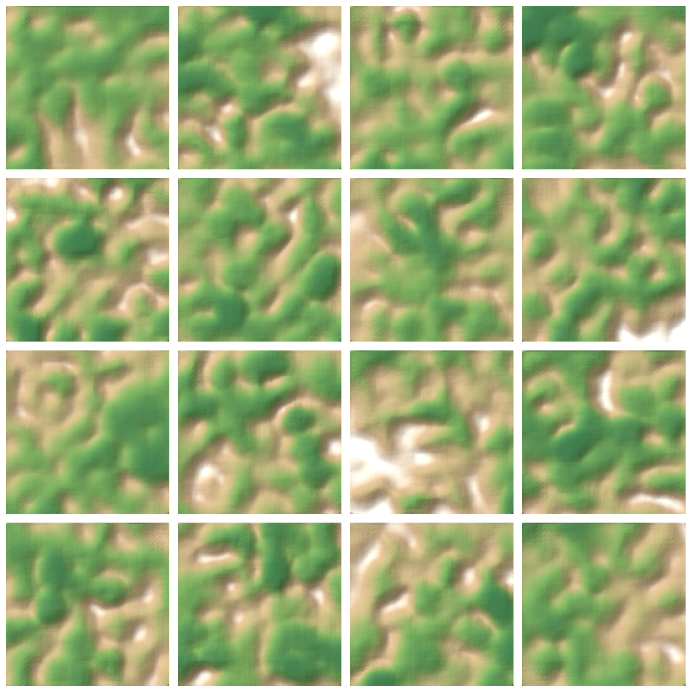

# Game Terrain VAE

Проект по генеративному моделированию для создания game-ready тайлов карт высот рельефа из данных о высотах в стиле DEM. В репозитории сравниваются подходы VAE, beta-VAE и Conditional VAE, сгенерированный рельеф оценивается геометрическими метриками, а также есть утилиты постобработки для более реалистичной детализации поверхности.



## Ключевые особенности проекта

- Построен PyTorch-пайплайн для одноканальных тайлов карт высот 256 x 256.
- Реализованы эксперименты с AE, VAE, beta-VAE, Conditional VAE, detail refiner и terrain fusion.
- Добавлена классово-условная генерация для рельефа `flat`, `hilly` и `mountain`.
- Оценены качество реконструкции и генеративное качество terrain-aware метриками: MAE, RMSE, gradient MAE, slope difference, roughness, high-frequency energy, Wasserstein distances и diversity.
- Экспортированы визуальные артефакты для оценки с точки зрения игр: 2D-карты высот, 3D-поверхности, рендеры в стиле Blender и сэмплы после постобработки.

## Ключевые результаты

### Реконструкция Conditional VAE

Лучший validation loss CVAE: **0.0143**. На тестовой выборке CVAE достиг:

| Metric | Value |
|---|---:|
| MAE | 0.0701 |
| RMSE | 0.0950 |
| Gradient MAE | 0.0218 |
| Slope difference | 0.0267 |
| Прибл. MAE в метрах | 11.10 m |
| Прибл. RMSE в метрах | 14.78 m |

Реконструкция по классам:

| Terrain | MAE | RMSE | Approx. MAE |
|---|---:|---:|---:|
| Flat | 0.0745 | 0.1013 | 1.80 m |
| Hilly | 0.0690 | 0.0942 | 7.99 m |
| Mountain | 0.0645 | 0.0856 | 32.39 m |

### Генеративная оценка

В генеративном сравнении использовалось 600 реальных тайлов на класс и 300 сгенерированных тайлов на класс.

| Model | Mode | RMSE | Grad MAE | Rough ratio | HF ratio | W1 slope | W1 rough | Diversity |
|---|---|---:|---:|---:|---:|---:|---:|---:|
| VAE | recon | 0.0911 | 0.0201 | 0.16 | 0.39 | - | - | - |
| VAE | gen | - | - | 0.16 | 0.30 | 0.0212 | 0.0270 | 10.9 |
| beta-VAE | recon | 0.0940 | 0.0213 | 0.71 | 0.38 | - | - | - |
| beta-VAE | gen | - | - | 0.90 | 0.29 | 0.0126 | 0.0167 | 18.1 |
| CVAE | recon | 0.0937 | 0.0204 | 0.25 | 0.38 | - | - | - |
| CVAE | gen | - | - | 0.36 | 0.31 | 0.0158 | 0.0219 | 14.1 |

beta-VAE дал наиболее реалистичные безусловные сэмплы по roughness и расстоянию между распределениями. CVAE оказался лучшим вариантом для управляемой генерации: сгенерированные сэмплы `flat -> hilly -> mountain` были монотонны по slope, roughness и диапазону высот.

## Метод

Пайплайн данных готовит нормализованные DEM-патчи:

- формат тензора: `[N, 1, 256, 256]`;
- нормализация: per-patch min-max в `[-1, 1]`;
- метаданные: класс рельефа, диапазон высот, статистика уклонов, исходные min/max высоты;
- управляемые метки: `flat`, `hilly`, `mountain`.

CVAE кондиционирует энкодер и декодер на класс рельефа и нормализованный диапазон высот. Gradient-aware reconstruction loss помогает сохранить структуру рельефа, а операции постобработки — эрозия, термальное сглаживание, степенные преобразования и warping — повышают game-readiness.

## Структура репозитория

```text
.
├── configs/              # конфиги экспериментов
├── figures/final/        # отобранные финальные визуализации
├── outputs/cvae/         # метрики CVAE и сетка сэмплов
├── results/              # таблицы оценки и сравнительные графики
├── src/
│   ├── data/             # подготовка датасета и разметка рельефа
│   ├── evaluation/       # метрики реконструкции и генерации
│   ├── models/           # AE, VAE, beta-VAE, CVAE, refiner, terrain fusion
│   ├── postprocess/      # операторы улучшения рельефа
│   ├── training/         # точки входа обучения и лоссы
│   └── visualization/    # утилиты карт высот и 3D-рендеринга
└── requirements.txt
```

## Быстрый старт

Установка зависимостей:

```bash
pip install -r requirements.txt
```

Подготовка локального датасета:

```bash
python -m src.data.prepare_dataset \
  --config configs/cvae.yaml
```

Обучение CVAE:

```bash
python -m src.training.train_cvae \
  --config configs/cvae.yaml
```

Запуск оценки:

```bash
python -m src.evaluation.eval_models \
  --config configs/cvae.yaml
```

Генерация примеров:

```bash
python -m src.visualization.generate_examples \
  --config configs/cvae.yaml
```

## Данные и артефакты

Исходные DEM-данные и чекпойнты моделей намеренно не хранятся в репозитории. В репозитории остаются код, конфиги, отобранные метрики и лёгкие визуальные артефакты. Большие локальные файлы игнорируются через `.gitignore`:

- `data/`
- `checkpoints/`
- `runs/`
- `*.pt`
- `*.ckpt`

## Стек технологий

`Python` · `PyTorch` · `NumPy` · `pandas` · `SciPy` · `Matplotlib` · `PyYAML` · `rasterio` · `DEM processing` · `Generative Modeling`
